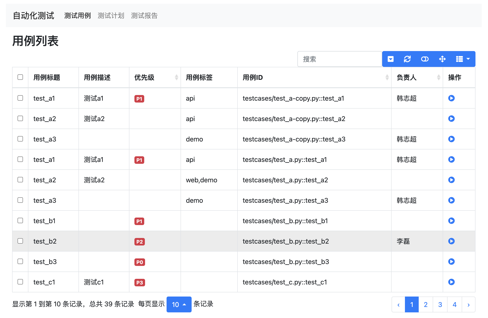
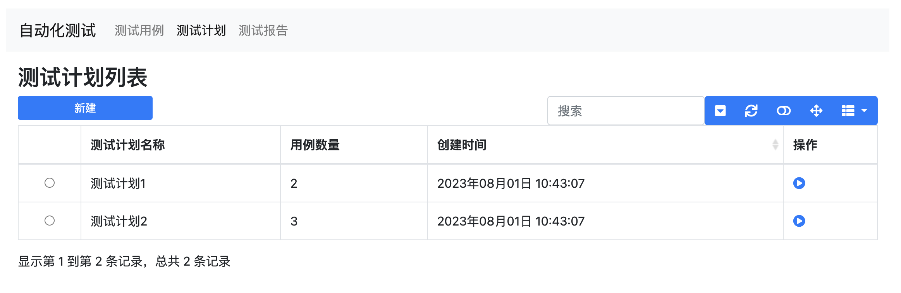
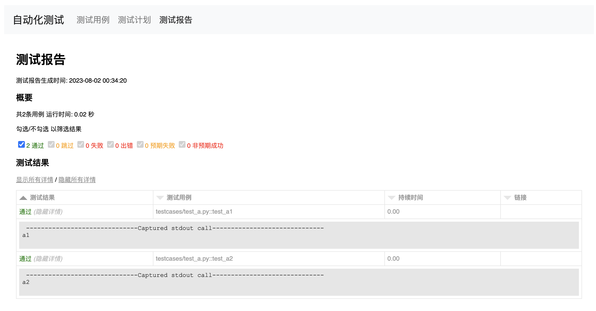

# 基于测试框架（文件系统的）测试平台








## 使用方法
1. 克隆项目
```shell
git clone https://github.com/hanzhichao/pytest-dashboard.git
```
2. 安装依赖
```shell
cd pytest-dashboard
pip install -r requirements.txt
```
3. 运行dashboard/app.py
```shell
python app.py
```
4. 访问开发服务器 <http://127.0.0.1:5001>


## 页面
- 用例列表（首页）
  - [x] 调试用例
  - [x] 用例列表
  - [x] 查看用例代码
  - [x] 新建用例
  - [x] 修改用例
  - [ ] 选择一批用例新建测试计划
- 测试套件（测试计划）
  - [ ] 编辑测试计划
  - [x] 运行测试计划

> 基于文件系统的测试平台和基于关系型数据库测试平台的区别

- 用例是一个一个py脚本中的一个函数
- 耦合性较高
- 运行比较简单（命令行或python调用）
- 不方便拿到运行结果
- 从网页上修改、编辑比较麻烦
- 需要生成和修改配置

## 参考
- [Bootstrap4中文文档](https://v4.bootcss.com/docs/getting-started/introduction/)
- [Bootstrap-Table Examples](https://examples.bootstrap-table.com/index.html)
- [FontAwesome v5](https://fontawesome.com/v5/search?q=code&o=r&m=free)
- [Pytest Api Reference](https://docs.pytest.org/en/7.4.x/reference/reference.html)